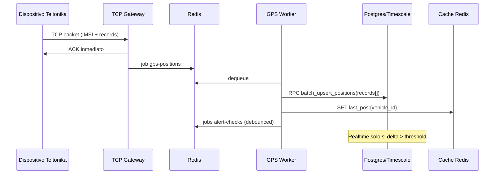

# Arquitectura de escalabilidad — TrackProGPS

**Versión:** 1.0 · Junio 2026  
**Estado:** Target architecture + evolución desde estado actual

---

## 1. Visión

TrackProGPS evoluciona de **monolito single-instance optimizado para ~500 dispositivos** a una **plataforma de telemática distribuida** capaz de:

- **100,000+** dispositivos GPS + mobile
- **Millones** de posiciones/día
- **Miles** de usuarios concurrentes en mapa
- **SLA 99.9%** ingesta GPS

Sin cambiar el contrato con dispositivos Teltonika existentes ni APIs mobile actuales.

---

## 2. Arquitectura actual (baseline)

```
                    ┌─────────────────────────────────────┐
                    │         Fly.io (1 VM)               │
  Teltonika :5000 ──┤  TCP + BullMQ Workers + Health       │
                    └──────────────┬──────────────────────┘
                                   │
         Mobile ──► Vercel ────────┼──────► Supabase Postgres
         Web PWA ──► Next.js ──────┘              │
                                                  ▼
                                            Realtime WAL
                                                  │
                                            Browser map
```

**Características:** colas BullMQ, particiones mensuales, RLS, Realtime nativo.

**Límites:** conexiones TCP in-memory, workers colocalizados, writes serializados, Realtime 1:1 con upserts.

---

## 3. Arquitectura target (Tier 3 — 100k dispositivos)

```
                         ┌──────────────── Cloudflare / WAF ────────────────┐
                         │                                                  │
    Teltonika fleet ─────┼──► TCP LB (session affinity by IMEI)             │
                         │         │                                          │
                         │    ┌────┴────┬────────────┐                        │
                         │    ▼         ▼            ▼                        │
                         │  Gateway   Gateway    Gateway   (stateless decode) │
                         │    │         │            │                        │
                         │    └────┬────┴────────────┘                        │
                         │         ▼                                          │
                         │   Redis Cluster (queues + pub/sub + cache)         │
                         │         │                                          │
                         │    ┌────┴────┬──────────┬──────────┐               │
                         │    ▼         ▼          ▼          ▼               │
                         │ GPS Worker Alert Worker Notif   Report Worker      │
                         │  (K8s HPA)  (K8s HPA)   Worker   (batch)           │
                         └─────────┼──────────────────────────────────────────┘
                                   │
              ┌────────────────────┼────────────────────┐
              ▼                    ▼                    ▼
      TimescaleDB / PG      Supabase Auth         Object Storage
      (position_history)    (users, RLS)          (exports, archives)
              │
              ▼
      Read Replicas ◄── Vercel / Edge API (cached last positions)
              │
              ▼
      Realtime (filtered) ◄── Web clients (1 Hz batch UI)
```

---

## 4. Flujo de datos optimizado

### 4.1 Ingesta GPS (hardware)



**Cambios clave:**
- Gateway **solo decode + ACK + enqueue** (nunca DB)
- **Batch RPC** — N registros → 1 transacción
- **Cache Redis** última posición para reads
- **Debounce alerts** — 1 evaluación por vehículo cada X segundos

### 4.2 Ingesta mobile

```
App Expo → POST /api/mobile/telemetry (batch points)
         → processMobileTelemetry (mismo batch RPC)
         → alert-processor-inline (hoy) → migrar a cola
```

Mobile mantiene el mismo endpoint; backend adopta batch internamente.

### 4.3 Lectura mapa (tiempo real)

```
Opción A (actual mejorada):
  SSR: últimas N posiciones + Realtime delta

Opción B (10k+ flotas):
  SSR: skeleton
  Client: GET /api/vehicles/positions?bbox=... (paginado geográfico)
  Realtime: solo vehículos visibles en viewport
  Redis: last_pos cache para cold start
```

### 4.4 Historial y reportes

```
Queries cortas (<7d): partition pruning position_history_YYYY_MM
Reportes pesados:     Read replica + materialized views diarias
Export CSV:           Job async → S3 signed URL
IA / analytics:       Read replica, no primary
```

---

## 5. Componentes escalables

### 5.1 Capa ingesta

| Componente | Responsabilidad | Escala |
|------------|-----------------|--------|
| TCP Gateway | IMEI, decode, ACK, enqueue | Horizontal, sticky IMEI |
| Connection registry | IMEI → gateway instance | Redis HASH |
| Command router | Enviar comandos al gateway correcto | Redis pub/sub |

### 5.2 Capa procesamiento

| Cola | Worker | Concurrencia target | Prioridad |
|------|--------|---------------------|-----------|
| `gps-positions` | Persist + cache | 50–200 pods | Alta |
| `alert-checks` | Rules + geofence | 20–100 pods | Media |
| `notifications` | Email/push/WA | 10–50 pods | Baja |
| `reports` | PDF/CSV/stats | 5–20 pods | Baja |
| `ai-jobs` | Claude tools batch | 2–10 pods | Baja |

**Separación crítica:** TCP nunca comparte proceso con workers pesados.

### 5.3 Capa datos

| Store | Rol | Escala |
|-------|-----|--------|
| Postgres primary | OLTP, auth, config | Vertical + connection pool |
| TimescaleDB chunks | position_history | Compresión 90%, retention policies |
| Redis | Queues + hot cache | Cluster 3+ nodes |
| Supabase Realtime | Live updates | Filtrar/throttle publicaciones |

### 5.4 Capa presentación

| Componente | Optimización |
|------------|--------------|
| Next.js | ISR para configs, dynamic solo mapa |
| Map Leaflet | Cluster default >50 markers |
| Map Google | Cluster o deshabilitar >200 |
| Realtime hook | Singleton client, 1 canal alertas |
| Mobile | Modos batería, batch upload |

---

## 6. Estrategia de cache

| Dato | TTL | Store | Invalidación |
|------|-----|-------|--------------|
| Última posición por vehículo | 60s | Redis | Write-through en worker |
| Device lookup IMEI | 5 min | In-process LRU | IMEI update |
| Alert rules por company | 3 min | In-process LRU | CRUD rules |
| Permisos usuario | 5 min | Redis / edge | Role change |
| Config empresa | 10 min | Redis | Settings update |
| Geofence geometries | 15 min | Redis | Geofence CRUD |

**Principio:** reads del mapa no golpean Postgres en cada refresh; Realtime complementa cache.

---

## 7. Particionamiento y archivado

### position_history

```
PARTITION BY RANGE (recorded_at) — mensual
  ├── Hot (0–90 días): SSD, queries frecuentes
  ├── Warm (90d–1y): mismo cluster, menos índices secundarios
  └── Cold (>1y): DROP partition o export S3 + DROP
```

### TimescaleDB (Tier 3)

- Hypertable con chunks de 7 días
- Compresión automática chunks >7 días
- Continuous aggregates: km/día, idle time

### alerts / mobile_events

- Partición mensual opcional >10M rows
- Retention: 90d operational, 1y archive

---

## 8. Realtime a escala

**Problema:** 10,000 upserts/s → 10,000 WAL events → N clientes suscritos.

**Mitigaciones:**

1. **Delta threshold:** upsert DB solo si movió >50m o >30s desde última publicación
2. **Channel per company:** ya implementado ✓
3. **UI batch 1 Hz:** ya implementado ✓
4. **Viewport filter:** cliente ignora vehículos fuera de bbox
5. **Fan-out alternativo:** a >5k vehículos/empresa, SSE desde Redis pub/sub en lugar de Realtime directo

**Capacidad estimada con mitigaciones:** ~2,000 vehículos activos/empresa en un mapa con 500 usuarios concurrentes.

---

## 9. Escalamiento horizontal — plan por tier

| Tier | Dispositivos | Arquitectura |
|------|--------------|--------------|
| **T1** | 1–1,000 | Actual + Ola 1–2 optimizaciones |
| **T2** | 1k–10k | Gateway/worker split, Redis cache, batch RPC |
| **T3** | 10k–100k | TCP LB, K8s workers, TimescaleDB, read replicas |
| **T4** | 100k+ | Multi-region ingest, sharding por company_id |

---

## 10. Observabilidad target

```
Prometheus / Grafana (o Fly metrics + Supabase dashboard)
  ├── gps_messages_total{status}
  ├── gps_queue_depth{queue}
  ├── gps_processing_duration_seconds
  ├── db_writes_per_second
  ├── realtime_events_per_second
  ├── active_tcp_connections
  └── api_request_duration{route}

Alertas:
  - queue_depth > 10,000 por 5 min
  - p95 processing > 500ms
  - TCP connections > 80% capacity
  - DB CPU > 80%
```

---

## 11. Mobile — modos propuestos

| Modo | Intervalo | Accuracy | Uso |
|------|-----------|----------|-----|
| Bajo consumo | 300s | Balanced | Personal field, batería |
| Normal | 60s | High | Operación estándar |
| Alta precisión | 10–30s | BestForNavigation | Seguridad, SOS activo |

Implementación: extender `TRACKING_INTERVALS` + `Location.Accuracy` por modo; batch upload cada N puntos o 60s.

---

## 12. Recuperación ante fallas

| Fallo | Comportamiento target |
|-------|----------------------|
| Redis down | Reject new TCP with backoff; no inline cascade |
| Worker crash | BullMQ retry + dead letter queue |
| DB slow | Queue backpressure; alert ops |
| Gateway crash | LB reroute IMEI on reconnect |
| Realtime lag | Client poll cache API fallback 30s |

---

## 13. Recomendaciones futuras

1. **Evaluar TimescaleDB** al superar 10M posiciones/mes
2. **API GraphQL/subscription** opcional para clientes enterprise
3. **Edge functions** para agregaciones dashboard ligeras
4. **CDC (Debezium)** si Realtime Supabase limita
5. **Multi-protocol gateway** (Queclink, Concox) como plugins sin tocar core
6. **Load test suite** en CI con k6 + simulador Teltonika
7. **Cost attribution** por company_id en métricas

---

## 14. Migración sin downtime

```
Fase A: Batch RPC (compatible, mismo TCP)
Fase B: Redis cache reads (additive)
Fase C: Split worker pod (mismo Redis)
Fase D: Second TCP gateway + Redis registry
Fase E: TimescaleDB migration (dual-write window)
```

Cada fase validada con load test antes de la siguiente.

---

*Ver [`PLAN_CAPACIDAD_TRACKPROGPS.md`](./PLAN_CAPACIDAD_TRACKPROGPS.md) para números y [`AUDITORIA_RENDIMIENTO_TRACKPROGPS.md`](./AUDITORIA_RENDIMIENTO_TRACKPROGPS.md) para gaps actuales.*
