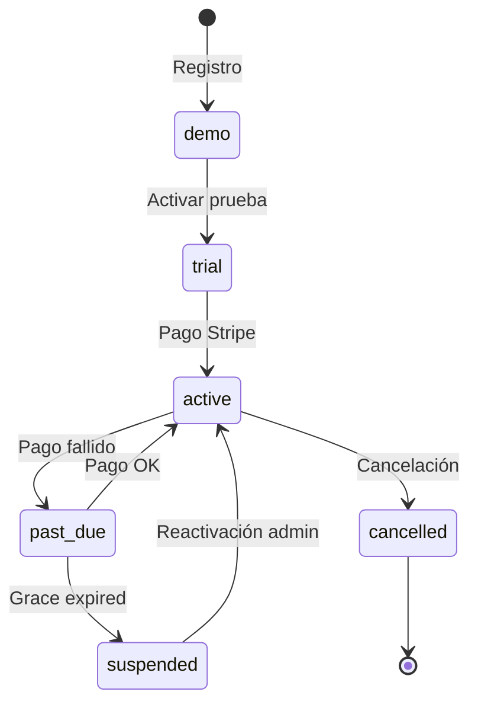

# Arquitectura SaaS — TrackProGPS

**Versión:** 1.0 · Junio 2026  
**Alcance:** Modelo multiempresa, comercial, distribución y escalamiento de negocio  
**Principio:** Un solo ecosistema — no sistemas separados

---

## 1. Resumen ejecutivo (CPO + CTO)

TrackProGPS **ya opera como SaaS multi-tenant** con aislamiento por `company_id`, RLS en Postgres, roles RBAC, billing Stripe y panel admin de plataforma. La evolución enterprise **extiende** este núcleo — no lo reemplaza.

| Capa | Estado actual | Target enterprise |
|------|---------------|-------------------|
| Multi-tenant | ✅ Implementado | + jerarquía distribuidor |
| Aislamiento datos | ✅ RLS | + auditoría completa |
| Planes y límites | ⚠ Parcial | Configurable + enforcement total |
| Billing | ✅ Stripe MXN | + Mercado Pago, CFDI |
| White label | ⚠ Flag en plan | Branding + dominio |
| Portal cliente | ✅ Dashboard | + consumo plan unificado |
| Portal distribuidor | ❌ | Nuevo módulo |
| API comercial | ⚠ Spec v1 | Implementación + webhooks |

---

## 2. Modelo de tenancy

### 2.1 Arquitectura actual (Tier 1 — Flat SaaS)

```
┌─────────────────────────────────────────────────────────────┐
│                    PLATAFORMA TrackProGPS                      │
│  super_admin │ platform team (interno@trackprogps.mx)         │
├─────────────────────────────────────────────────────────────┤
│  Tenant A          │  Tenant B          │  Tenant C          │
│  company_id: uuid  │  company_id: uuid  │  company_id: uuid  │
│  users, vehicles   │  users, vehicles   │  users, vehicles   │
│  devices, alerts   │  devices, alerts   │  devices, alerts   │
│  subscription      │  subscription      │  subscription      │
└─────────────────────────────────────────────────────────────┘
         │                    │                    │
         └────────────────────┼────────────────────┘
                              ▼
                    Supabase Postgres
                    (single schema + RLS)
```

**Decisión arquitectónica:** un esquema Postgres con `company_id` en cada tabla tenant — mantenible hasta ~1,000 empresas y millones de posiciones (ver `ARQUITECTURA_ESCALABILIDAD_TRACKPROGPS.md`).

### 2.2 Arquitectura target (Tier 2 — Reseller / White Label)

```
┌──────────────────────────────────────────────────────────────┐
│ TrackProGPS Platform (super_admin)                            │
├──────────────────────────────────────────────────────────────┤
│  DISTRIBUIDOR (partner)                                       │
│  partner_id │ branding │ commission_rate │ child_tenants[]   │
│     ├── Cliente final A (company)                             │
│     ├── Cliente final B (company)                             │
│     └── Cliente final C (company)                             │
├──────────────────────────────────────────────────────────────┤
│  CLIENTE DIRECTO (company) — sin partner                      │
│     ├── Sucursal lógica → vehicle_groups (hoy)                │
│     └── Sucursal física → branches (futuro)                   │
└──────────────────────────────────────────────────────────────┘
```

**Reutilización:** `vehicle_groups` + `user_vehicle_group_access` ya resuelven **segmentación intra-empresa** (flotillas, familia). Las **sucursales físicas** y **distribuidores** requieren extensión de schema.

---

## 3. Entidades del modelo SaaS

### 3.1 Implementadas hoy

| Entidad | Tabla | Descripción |
|---------|-------|-------------|
| Plan | `plans` | Catálogo comercial, features JSONB |
| Empresa | `companies` | Tenant principal |
| Usuario | `users` | Extiende `auth.users`, rol + company |
| Suscripción | `subscriptions` | Stripe IDs, status, plan |
| Grupo vehicular | `vehicle_groups` | Sub-segmentación flota |
| Acceso grupo | `user_vehicle_group_access` | Permisos por flotilla |
| API Key | `api_keys` | Por empresa, hash SHA256 |
| Audit log | `audit_logs` | Trazabilidad parcial |
| Ticket soporte | `support_tickets` | Mesa de ayuda |

### 3.2 Campos clave `companies`

```sql
companies (
  id, name, rfc, email, phone, address,
  logo_url,                    -- branding básico ✓
  plan_id,                     -- plan asignado
  status,                      -- trial | active | suspended | cancelled | demo
  trial_ends_at,
  settings jsonb               -- demo_tour, billing_cfdi, pending_checkout, branding (target)
)
```

### 3.3 Extensiones propuestas (sin romper compat)

| Entidad | Tabla nueva | Propósito |
|---------|-------------|-----------|
| Partner/Distribuidor | `partners` | Reseller, comisión, branding |
| Relación partner-tenant | `companies.partner_id` FK nullable | Quién vendió la cuenta |
| Sucursal | `branches` | Ubicación física, contacto |
| Licencia | `licenses` | Activación, expiración, suspensión |
| Factura | `invoices` | CFDI + Stripe invoice sync |
| Uso/consumo | `usage_snapshots` | Métricas para límites y billing |
| Webhook suscriptor | `webhook_endpoints` | Integraciones ERP/CRM |

**Regla:** campos nuevos nullable; tenants existentes siguen operando sin partner ni branch.

---

## 4. Aislamiento y seguridad entre clientes

### 4.1 Capas de aislamiento (defensa en profundidad)

```
Capa 1: Supabase Auth (JWT por usuario)
Capa 2: RLS Postgres (company_id = get_company_id())
Capa 3: API route guards (role + company scope)
Capa 4: UI permissions (PermissionsProvider)
Capa 5: Realtime filters (company_id en channel)
```

### 4.2 Helpers RLS

- `get_company_id()` — extrae tenant del JWT vía tabla `users`
- `is_super_admin()` — bypass controlado para operaciones plataforma
- `user_can_access_vehicle()` — sub-scope por vehicle_group

### 4.3 Gaps enterprise

| Gap | Remediación |
|-----|-------------|
| Middleware solo refresh sesión | RBAC en middleware rutas sensibles |
| super_admin bypass total | Audit log obligatorio en acciones admin |
| Sin impersonation auditada | Modo "ver como cliente" con log |
| Partner cross-tenant | RLS policy delegada por `partner_id` |

Ver [`SEGURIDAD_TRACKPROGPS.md`](./SEGURIDAD_TRACKPROGPS.md).

---

## 5. Segmentos de mercado (account_type)

Ya implementado en migración 012:

| Tipo | Uso | Grupos default |
|------|-----|----------------|
| `personal` | 1–2 vehículos | Familia |
| `family` | Hogar extendido | Miembros familiares |
| `business` | Flotas comerciales | Flotilla principal, Operación |

Esto **no es multi-tenant** — es clasificación comercial dentro del mismo modelo `companies`.

---

## 6. Roles y permisos (estado + evolución)

### 6.1 Roles actuales

| Rol | Alcance | Capacidades clave |
|-----|---------|-------------------|
| `super_admin` | Plataforma | Todas las empresas, billing platform |
| `admin_empresa` | Tenant | Usuarios, billing, config |
| `supervisor` | Tenant | Flota, alertas, reportes |
| `operador` | Tenant | Operación diaria, mapa |
| `cliente_consulta` | Tenant | Solo lectura |
| `miembro_familiar` | Grupo | Vehículos asignados |

Implementación: `apps/web/src/lib/auth/permissions.ts`

### 6.2 Roles target enterprise

| Rol nuevo | Descripción |
|-----------|-------------|
| `partner_admin` | Administra tenants hijos del distribuidor |
| `partner_sales` | Crea clientes, ve comisiones |
| `branch_manager` | Administra sucursal específica |
| `conductor` | App mobile, vehículo asignado |

### 6.3 Modelo permisos flexible (target)

```
permissions (resource, action) × role_assignments
  resources: vehicles, users, reports, maps, alerts, settings, billing, api
  actions: read, write, delete, export, manage
```

**Migración:** mantener 6 roles actuales como presets; agregar matriz opcional por empresa enterprise.

---

## 7. Flujos comerciales

### 7.1 Registro self-service (actual)

```
/register → POST /api/auth/register
  → Auth user + company (demo) + subscription (cancelled)
  → pending_checkout en settings (opcional)
  → Email confirm → Login → DemoGate / Billing
```

### 7.2 Onboarding flota (actual)

```
POST /api/clients/onboard (admin_empresa+)
  → driver + device + vehicle + geofences
  → audit_log client.onboard
```

### 7.3 Provisioning por distribuidor (target)

```
Partner portal → POST /api/partners/tenants
  → company + admin user + plan + license
  → email bienvenida white label
  → partner commission record
```

### 7.4 Ciclo de vida cuenta



Estados en `companies.status` + `subscriptions.status`.

---

## 8. Integración de módulos existentes

Todo vive en el **mismo monorepo** y **misma base de datos**:

| Módulo | Integración SaaS |
|--------|------------------|
| GPS Teltonika | `gps_devices.company_id` — límite vehículos |
| Mobile Tracker | `source_type: mobile` — límite dispositivos móvil |
| Mapas / Realtime | Filtrado RLS por company |
| Alertas | Reglas por company, plan feature `alerts` |
| Reportes | Plan feature `reports`, export según rol |
| IA (TrackPro AI) | Plan feature `ai_assistant`, gate API |
| IoT / sensores | Extensión `raw_io`, mismo tenant |
| Geocercas | Plan feature `geofences` |
| Mantenimiento | Plan feature `maintenance` |

**No crear:** portal separado, DB separada, ni auth separada para mobile.

---

## 9. Stack y despliegue SaaS

| Componente | Rol SaaS |
|------------|----------|
| Vercel | Web + API multi-tenant |
| Supabase | Auth + DB + Realtime |
| Stripe | Suscripciones MXN |
| Resend | Emails transaccionales |
| Fly.io | Ingesta GPS (por tenant vía device→company) |

**White label dominio:** CNAME → Vercel + middleware detecta tenant por hostname → carga `settings.branding`.

---

## 10. Roadmap arquitectónico SaaS

| Fase | Entregable | Dependencia |
|------|------------|-------------|
| S1 | Enforcement límites completo | Código |
| S2 | Tabla `invoices` + CFDI básico | Stripe + PAC |
| S3 | `partners` + portal distribuidor | Schema + UI |
| S4 | White label branding UI | settings.branding |
| S5 | API v1 + webhooks | api_keys existente |
| S6 | Licencias + usage_snapshots | Billing |
| S7 | SSO enterprise | Supabase SAML |

---

## 11. Decisiones de diseño

| Decisión | Alternativa descartada | Razón |
|----------|------------------------|-------|
| Single schema multi-tenant | DB por cliente | Costo ops, migraciones |
| RLS vs app-only filters | Solo API guards | Realtime + seguridad DB |
| vehicle_groups para sub-flota | branches desde día 1 | Ya implementado, suficiente SMB |
| Stripe primero | Mercado Pago only | Subscriptions maduras; MP como fase 2 |
| Extender companies.settings | Tablas separadas branding | Menor migración inicial |

---

## 12. Referencias

- [`MODELO_COMERCIAL_TRACKPROGPS.md`](./MODELO_COMERCIAL_TRACKPROGPS.md)
- [`SISTEMA_PLANES_TRACKPROGPS.md`](./SISTEMA_PLANES_TRACKPROGPS.md)
- [`WHITE_LABEL_TRACKPROGPS.md`](./WHITE_LABEL_TRACKPROGPS.md)
- [`API_COMERCIAL_TRACKPROGPS.md`](./API_COMERCIAL_TRACKPROGPS.md)
- [`MANUAL_ADMINISTRADOR_SAAS.md`](./MANUAL_ADMINISTRADOR_SAAS.md)
- [`ANALISIS_ARQUITECTURA_TRACKPROGPS.md`](./ANALISIS_ARQUITECTURA_TRACKPROGPS.md)
- [`TRACKPRO_ENTERPRISE.md`](./TRACKPRO_ENTERPRISE.md)

---

*Prompt 6 — Fase 1 completada. Implementación incremental sobre arquitectura existente.*
